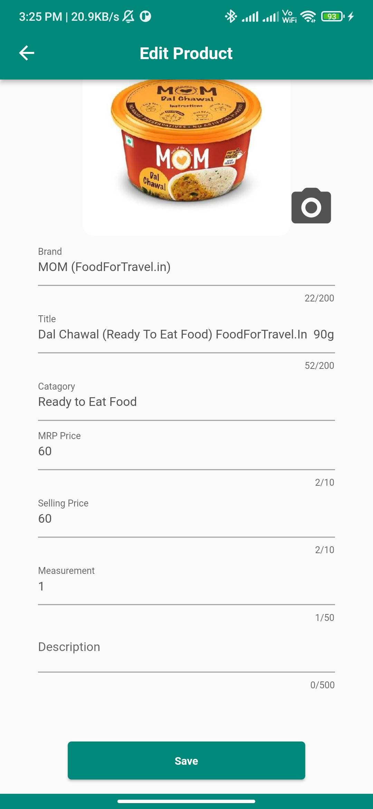
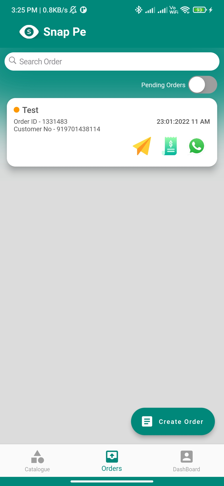
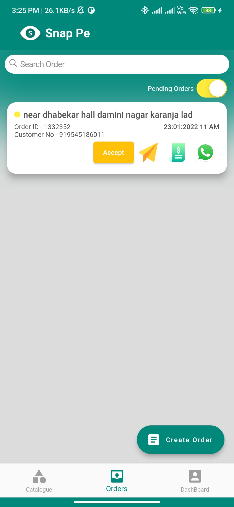
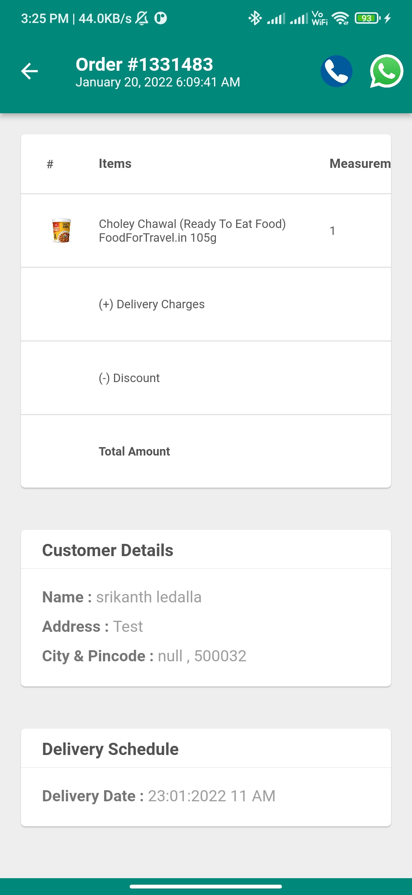
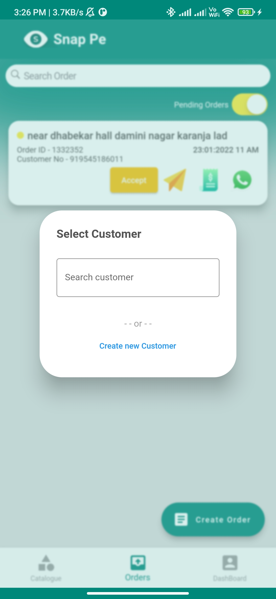
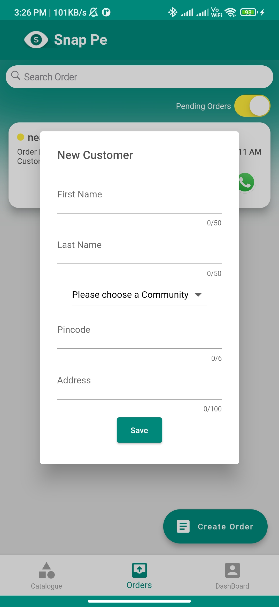
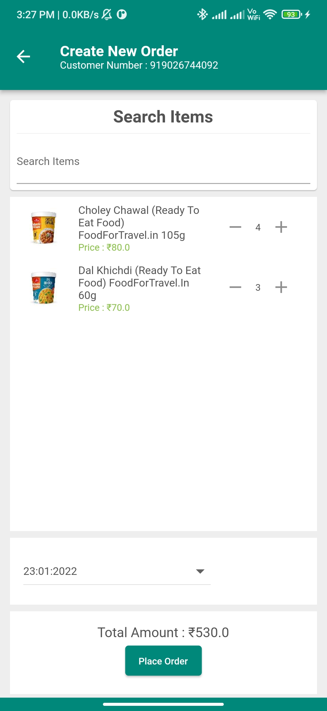

# Snap Pe - Online Shop Creator <a href="https://play.google.com/store/apps/details?id=com.divigo.snappemerchant">- On PlayStore</a>

This is Flutter based Application, which is using for create own online Shop in http://snap.pe/.
With the help of this app Merchant can create own Catalogue and order and also they can manipulate them.
Team Size - 1
Framework - Flutter
Language - Dart
Packages - cupertino_icons, google_fonts, http, sms_autofill, sqflite , path_provider , shared_preferences, image_picker, image_cropper, fluttertoast, flutter_typeahead, carousel_slider, dio, intl, url_launcher, share_plus, permission_handler flutter_easyloading get webview_flutter flutter_widget_from_html_core bubble socket_io_client, emoji_picker_flutter, firebase_core, firebase_messaging, flutter_local_notifications, firebase_auth, cloud_firestore, flutter_linkify, simple_rich_text, custom_searchable_dropdown

  
   
  
  
  
 
